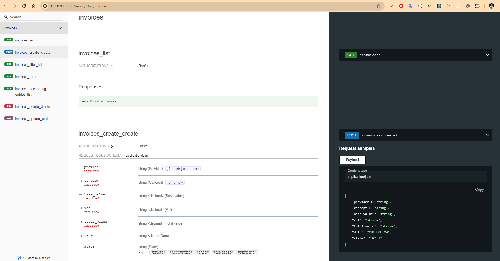

# Requisitos Parte 1
- Proyecto de Gestión de Facturas API
- Prueba Técnica: Diseño de API REST de Contabilización de Facturas

## Introdución de la documentación

Este proyecto sigue el patrón **Modelo-Vista (MVT)** de Django, y se integra con una API para gestionar las facturas.

## **Sumario de Componentes y Decisiones Clave:**

- **Modelo MVT (Django):** Implementación del patrón Modelo-Vista-Template, separando las responsabilidades. Los templates irán ser la próxima feature.
- **Rutas:** CRUD completo para gestionar las facturas, con filtros para estados y fechas.
- **Vista:** Vistas para manejar las rutas de la API y documentación automática con Swagger/OpenAPI.
- **Servicio:** `InvoiceService` para separar la lógica de negocio de las vistas.
- **Enums:** Uso de `enum` para los estados de la factura y los códigos contables.
- **Modelo:** `InvoiceModel` para representar las facturas en la base de datos, con validaciones.
- **Base de datos (MySQL):** Uso de MySQL como base de datos para las facturas.
- **Migración:** Migraciones para gestionar los cambios de esquema en la base de datos.
- **Test Unitarios:** Implementación de pruebas unitarias para cada componente.
- **Test Coverage:** Monitoreo de la cobertura de las pruebas.
- **Validación:** Validación de datos usando `clean()` y `ValidateInvoice`.
- **README:** Instrucciones claras sobre cómo configurar y usar el proyecto.
- **Documentación OpenAPI:** Generación automática de la documentación de la API.

## **Links relacionados:**

- **Github**:
  - [Aplicacion Gestión de Facturas API](https://github.com/victor90braz/django-invoice-management-api)

- **Entender mejor el porqué de los códigos contables**:
  - [Contabilizar IVA - Defeza Asesores](https://defezasesores.es/blog/contable/contabilizar-iva/)
  
- **Útil para implementar Swagger**:
  - [Generación automática de especificaciones Swagger](https://swagger.io/blog/api-development/automatically-generating-swagger-specifications-wi/)

  ## Test Coverage Report

  

  ## API Documentation REDOC

  

---

### **`urls.py`**
**ENDPOINTS >> CONTEXTO**  
He implementado un CRUD completo para gestionar las facturas, permitiendo crear, leer, actualizar y eliminar facturas de manera sencilla. Se añadió un sistema de filtros en la ruta para poder filtrar las facturas por estado y fechas, lo que mejora la búsqueda de facturas específicas. Además, se agregó la generación de asientos contables para cada factura, proporcionando una funcionalidad integral para la contabilidad.

---

### **`invoice_view.py`**
**VIEW >> CONTEXTO**  
Por el momento, he implementado las vistas para manejar las rutas de la API. Es posible que se puedan crear nuevas vistas para un mejor manejo. Swagger genera automáticamente la documentación OpenAPI. Los middlewares como `AllowAny` e `IsAuthenticated` se utilizan para manejar la autenticación y autorización. Este flujo se puede redefinir para ajustarse mejor a lo que se quiere lograr, pero de momento lo implementé para empezar a entender cómo aplicarlo y probarlo. Implementé un sistema de validación usando `ValidateInvoice`, que asegura que el payload sea válido antes de ser procesado. Manejo los errores de forma centralizada, proporcionando respuestas más amigables para el cliente.  
- **DEFINIR ACTION**: Este manejo de errores se puede redefinir y centralizar en el servicio si es necesario.  
El flujo de trabajo en las vistas está diseñado para hacer una primera consulta a la base de datos local. Si no se encuentra un resultado, se realiza una búsqueda en una API externa.  
- **DEFINIR ACTION**: En caso de que se haga la solicitud a una API externa, se deben redefinir los returns (`JsonResponse`).

---

### **InvoiceService**
La principal razón para implementar el `InvoiceService` es separar la lógica de negocio del View. Esto permite que el código sea más mantenible, y escalable. Flexible si en el futuro cambiamos la API externa o la lógica de la aplicación.

---

### **ENDPOINTS**
- **Listar facturas:** `GET /invoices/`
- **Crear una factura:** `POST /invoices/`
- **Obtener detalles de una factura:** `GET /invoices/{invoice_id}/`
- **Actualizar una factura:** `PUT /invoices/{invoice_id}/`
- **Eliminar una factura:** `DELETE /invoices/{invoice_id}/`
- **Filtrar facturas:** `GET /invoices/filter/`
- **Generar asientos contables:** `GET /invoices/{invoice_id}/accounting-entries/`

---

### **InvoiceModel**
**MODEL >> CONTEXTO**  
El `InvoiceModel` representa la estructura de las facturas en la base de datos, gestionando la información relacionada con las facturas y asegurando la validez de los datos mediante validaciones.

#### **Campos del Modelo:**
- **`provider:`** `CharField` (máx. 255 caracteres) — Proveedor de la factura.
- **`concept:`** `TextField` — Descripción o concepto de la factura.
- **`base_value:`** `DecimalField` (10 dígitos, 2 decimales) — Valor base de la factura.
- **`vat:`** `DecimalField` (10 dígitos, 2 decimales) — Valor del IVA aplicado.
- **`total_value:`** `DecimalField` (10 dígitos, 2 decimales) — Valor total de la factura.
- **`date:`** `DateField` — Fecha de emisión de la factura (por defecto, la fecha actual).
- **`state:`** `CharField` — Estado de la factura, basado en `InvoiceStates.choices` (valor por defecto: DRAFT).

#### **Métodos del Modelo:**
- **`clean():`** Valida que los valores de la factura sean consistentes (ej. `base_value` + `vat` = `total_value`).
- **`__str__():`** Devuelve una representación legible de la factura: `"Invoice {id} - {provider} ({state})"`.

---

### **Enums**
He decidido utilizar `enum` para definir los estados de la factura, ya que garantiza valores predefinidos, mejora la legibilidad del código y reduce el riesgo de errores.

#### **AccountingCodes**
**ENUM >> CONTEXTO**  
El `AccountingCodes` es un `enum` que define los códigos contables utilizados en el sistema para categorizar las transacciones contables, como compras, IVA soportado y proveedores. Cada código está asociado a una descripción que ayuda a identificar su propósito contable.

#### **Opciones del Enum:**
- **`PURCHASES:`** `"6000"` — Compras (DEBITO).
- **`VAT_SUPPORTED:`** `"4720"` — IVA soportado (DEBITO).
- **`SUPPLIERS:`** `"4000"` — Proveedores (CREDITO).

---

#### **InvoiceStates**
**ENUM >> CONTEXTO**  
El `InvoiceStates` es un `enum` que define los posibles estados de una factura dentro del sistema, facilitando la gestión de su ciclo de vida, desde su creación hasta su pago o cancelación.

#### **Opciones del Enum:**
- **`DRAFT:`** `"DRAFT"` — Borrador.
- **`ACCOUNTED:`** `"ACCOUNTED"` — Contabilizada.
- **`PAID:`** `"PAID"` — Pagada.
- **`CANCELED:`** `"CANCELED"` — Cancelada.
- **`PENDING:`** `"PENDING"` — Pendiente.

---

#### **InvoiceStates**
**Testings >> CONTEXTO**  
He implementado un conjunto de pruebas unitarias para asegurar el correcto funcionamiento de del SERVICE y de la VIEW. 

- **`HAPPY PATHS:`** — Pruebas de flujos donde el servicio y las vistas funcionan correctamente, como la creación, lectura, actualización y eliminación de facturas con datos válidos.

- **`EDGE CASES:`** — Pruebas de situaciones inesperadas o de borde, como datos inválidos, autenticación fallida o intentos de acceder a facturas no existentes.

