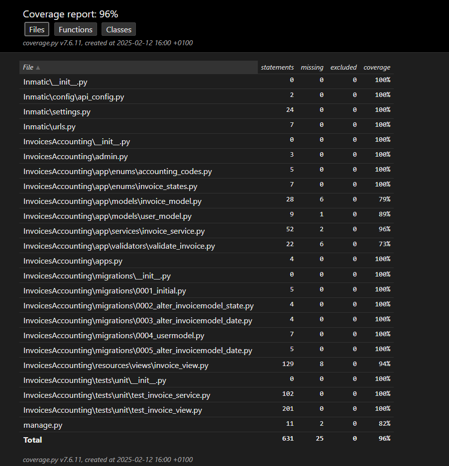
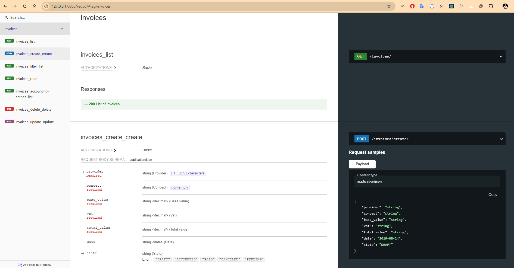

# Django Invoice Management API

Django Invoice Management API for managing invoices and related services.

## Setup Instructions
```bash
git clone https://github.com/victor90braz/django-invoice-management-api.git
```

```bash
cd Inmatic
```

 **Set Up the Virtual Environment**  
```bash
python -m venv venv
```

Activate the virtual environment:

- **Windows**:  
  ```bash
  venv\Scripts\activate
  ```
- **Mac/Linux**:  
  ```bash
  source venv/bin/activate
  ```

### 3. **Install Dependencies**  
```bash
pip install -r requirements.txt
```

### 4. **Create and Apply Migrations**  
```bash
python manage.py migrate
```

### 5. **Create a Superuser**  
```bash
python manage.py createsuperuser
```

### 6. **Run the Development Server**  
```bash
python manage.py runserver
```

### 7. **Access the Django Admin Panel**  
`http://127.0.0.1:8000/admin`.

### 8. **How to run the unit Testings**  
```bash
python manage.py test InvoicesAccounting.tests.unit
```

### 9. **How to run Test Coverage**  
```bash
python -m coverage run manage.py test InvoicesAccounting.tests.unit
```  
Generate a report:  
```bash
python -m coverage report
```  
Generate an HTML report:  
```bash
python -m coverage html
```
## Test Coverage Report



## Features

    path('admin/', admin.site.urls),  

    # Retrieve a list of invoices (GET)
    path("invoices/", list_invoices, name="invoice-list"),

    # Retrieve details of a specific invoice (GET)
    path("invoices/<int:invoice_id>/", get_invoice_detail, name="invoice-detail"),

    # Create a new invoice (POST)
    path("invoices/create/", create_invoice, name="invoice-create"),

    # Update an existing invoice (PUT)
    path("invoices/<int:invoice_id>/update/", update_invoice, name="invoice-update"),

    # Delete an invoice (DELETE)
    path("invoices/<int:invoice_id>/delete/", delete_invoice, name="invoice-delete"),

    # Filter invoices based on query parameters (GET)
    path("invoices/filter/", filter_invoices, name="invoice-filter"),

    # Generate accounting entries for an invoice (GET)
    path("invoices/<int:invoice_id>/accounting-entries/", generate_accounting_entries, name="invoice-accounting-entries"),

    # API Documentation UI
    path('redoc/', schema_view.with_ui('redoc', cache_timeout=0), name='schema-redoc'),

# API Documentation REDOC   



## Validation and Serializer

### Validation in the View

In the view, when creating an invoice, we validate the request data using a serializer. If required fields like `date`, `base_value`, `vat`, or `total_value` are missing or invalid, a validation error is raised.

### Serializer Workflow

- The `ValidateInvoice` serializer validates incoming data. If invalid, it returns errors.
- The model’s `clean()` method is also called for further validation, ensuring `base_value`, `vat`, and `total_value` are correct.

### Model's `clean()` Method

The `clean()` method in `InvoiceModel` checks the following:
- `base_value` must be greater than zero.
- `vat` must not be negative.
- `total_value` must match the sum of `base_value` and `vat`.
